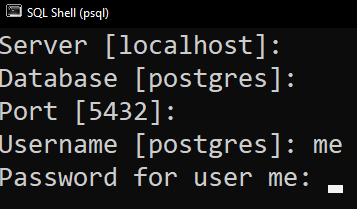

# CRUD API com Node, Express e PostgreSQL

Uma API simples, com comandos CRUD, feita com Node e Express, usando um pacote chamado node-postgres.

# PASSO 1 - INSTALAÇÃO E CONFIGURAÇÃO

1.1 Instalar o Node.js:

[Download | Node.js (nodejs.org)](https://nodejs.org/en/download/)

1.2 Instalar e configurar o PostgreSQL:

[How to Run and Setup a Local PostgreSQL Database | Prisma](https://www.prisma.io/dataguide/postgresql/setting-up-a-local-postgresql-database)

Esta página contém todos os passos e comandos necessários para começar a usar o PostgreSQL.

1.3 Instalar um editor de código (preferencialmente Visual Studio Code):

[Download Visual Studio Code - Mac, Linux, Windows](https://code.visualstudio.com/Download)

# PASSO 2 - CONFIGURAÇÃO

2.1 Após a instalação, abrir o prompt de comando *psql* e, logado como superuser (quando a linha fica `postgres=#` ) criar um novo ROLE chamado *me*, escolhendo o password de sua preferência:

`postgres=# CREATE ROLE me WITH LOGIN PASSWORD 'password';`

2.2 Saia da sessão atual com o comando `postgres=# \q`

2.3 Abrindo novamente o *psql*, pressione ENTER até a linha de Username e faça login com o novo ROLE me, seguindo as instruções abaixo:



O prompt mudará para `postgres⇒` , informando que você não está mais logado como superuser.

2.4 Agora vamos criar o banco de dados para a API usando o comando

`postgres=> CREATE DATABASE api;`

e também conectaremos a ele pelo comando

`postgres=> \c api`

Deixando nossa linha assim

`api=>`

2.5 O nome da nossa tabela principal será *todos* (tradução e abreviação de Lista de Tarefas em inglês) e a criação dela será assim:

```
CREATE TABLE todos (ID SERIAL PRIMARY KEY, tarefas VARCHAR(30),
local VARCHAR(30), data VARCHAR(30), concluido BOOLEAN);
```

2.6 Testar para ter certeza se a tabela foi criada com sucesso inserindo duas entradas de exemplo

```
INSERT INTO todos (tarefas, local, data, concluido)
  VALUES ('Dentista', 'Hilario Ribeiro 202', '22 de abril', true), 
('Oftalmo', 'Ipiranga 2000', '30 de abril', false);
```

2.7 Após escolher um diretório para o projeto, no terminal do Visual Studio Code,  escrever cada comando abaixo , pressionar ENTER e esperar a instalação:

Node Package Manager

`npm install -g npm`

Iniciando o Node

`npm init -y`

Instalando Express e node-postgres

`npm i express pg`

# PASSO 3 - CONFIGURAÇÃO DE USER E PASSWORD

3.1 No arquivo queries.js, insira seu password escolhido e, caso você esteja usando outro nome de usuário e porta, por favor inserir nos atributos `user` e `port`, dentro de `pool`

```jsx
const Pool = require("pg").Pool;
const pool = new Pool({
  user: "me",
  host: "localhost",
  database: "api",
  password: "",
  port: 5432,
});
```

# PASSO 4 - INICIAR O SERVIDOR

4.1 Usar o comando `node index.js` no terminal

# PASSO 5 - TESTAR AS ROTAS

GET  
http://localhost:3000/todos  
http://localhost:3000/todos/:id  
POST  
http://localhost:3000/todos  
UPDATE  
http://localhost:3000/todos/:id  
DELETE  
http://localhost:3000/todos/:id  
